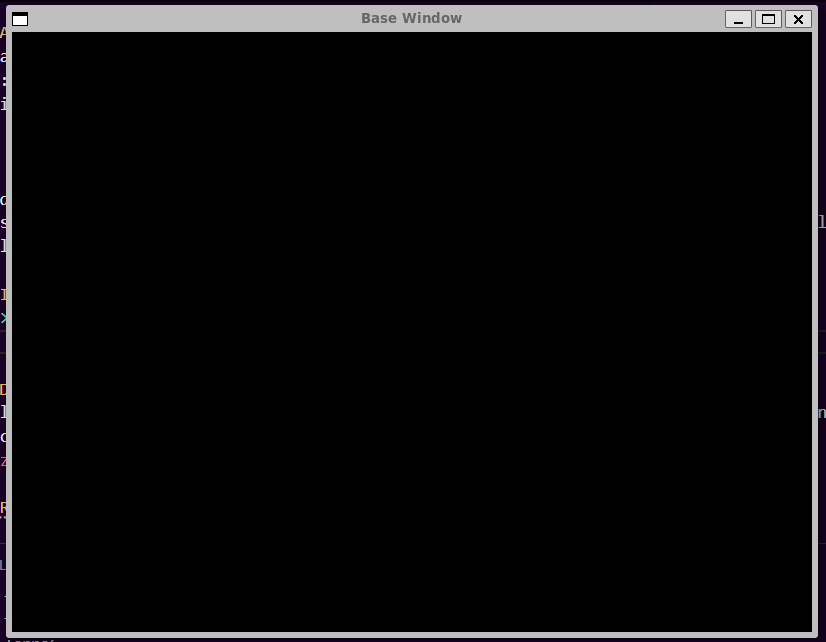

# TAPPA 00 - SETUP BASE DELLA FINESTRA 

## OBIETTIVO DELLA TAPPA:
Creazione della finestra di rendering principale e implementazione del Game Loop per la gestione degli eventi base (chiusura e ridimensionamento).

## COSA È STATO IMPLEMENTATO: 
- La finestra è stata configurata con:
    * Titolo: Base Window 
    * Proporzioni: 800x600 
    * Limite di frame: 60 FPS
    * Sfondo: nero
- Gli eventi sono stati gestiti tramite la funzione window.handleEvents. 
- È stata implementata una logica che forza il mantenimento delle proporzioni originali (4:3) nel caso l'utente cerchi di ridimensionare la finestra manualmente per evitare distorsioni grafiche del contenuto.

## VERIFICA DEL RISULTATO: 
All'avvio dell'esecuzione, dovrebbe essere mostrata su schermo una finestra nera di dimensioni 800x600 e con titolo "Base Window".
- Provando a ridimensionare la finestra, il contenuto dovrebbe adattarsi mantenendo le proporzioni 4:3.
- Cliccando il pulsante di uscita dalla finestra ("X" in alto a sinistra) il programma dovrebbe terminare.   

Allego uno screenshot del risultato da me ottenuto:  

## PROBLEMI RISCONTRATI E SOLUZIONI: 
Nessuno (per motivazione spiegata nel punto sottostante).

## FONTI DI RIFERIMENTO UTILIZZATE: 
Per questa tappa è stato utilizzato il codice sviluppato (durante le lezioni insieme al professor Puppo) per lo svolgimento del laboratorio 3.  
Le uniche modifiche apportate a detto codice sono state l'aggiunta di commenti e il cambio del titolo della finestra.  
