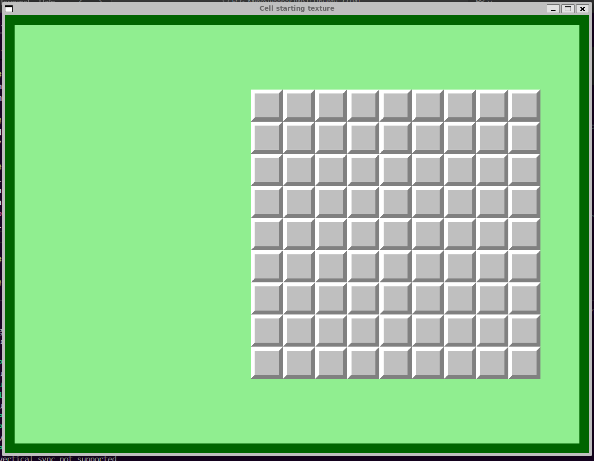

# TAPPA 1A - SFONDO E CELLA 9X9

## OBIETTIVO DELLA TAPPA: 
Impostare la grafica: 
- base (sfondo e bordo interno) della finestra
- delle strutture dati fondamentali (Struct) per rappresentare la logica del gioco (Cella, Griglia 9x9, Pannello di Gioco).

## COSA È STATO IMPLEMENTATO: 
Rispetto alla tappa precedente:
- è stato impostato un nuovo colore di sfondo per la finestra (verde chiaro).
- è stato creato un bordo per la finestra tramite la definizione di una RectangleShape di dimensioni leggermente ridotte rispetto alla finestra, posizione di orgine leggermente spostata rispetto alla finestra, colore trasparente e bordo spesso quanto la differenza di dimensione tra finestra e la shape appena creata (cioè 15 pixel).
- sono state definite le struct (con le loro funzioni draw(), parametri e i loro costruttori) per rappresentare: 
    * la griglia (Grid); 
    * le celle (Cell); 
    * il pannello di gioco (Game Panel); 
    * lo stato complessivo della finestra (State).

## VERIFICA DEL RISULTATO: 
All'apertura la finestra dovrebbe mostrare:
- uno sfondo verde chiaro; 
- un bordo verde scuro; 
- Una griglia 9x9 di celle grigie (texture 'Covered'), posizionata centralmente in verticale e spostata a destra in orizzontale;   
Allego uno screenshot del risultato da me ottenuto:  

## PROBLEMI RISCONTRATI E SOLUZIONI: 
#### PROBLEMA: 
Creare un bordo interno per la finestra (in quanto in SFML non esiste un comando specifico per impostare un bordo interno alla finestra stessa). 
#### SOLUZIONE: 
È stata definita una RectangleShape di dimensioni leggermente ridotte rispetto alla finestra, posizione di orgine leggermente spostata rispetto alla finestra, colore trasparente e bordo spesso quanto la differenza di dimensione tra finestra e la shape appena creata (cioè 15 pixel) e colore verde scuro.
Ciò va a creare l'effetto di bordo interno

## FONTI DI RIFERIMENTO UTILIZZATE:  
Nessuna (oltre a quelle utilizzate nelle tappe precedenti).

