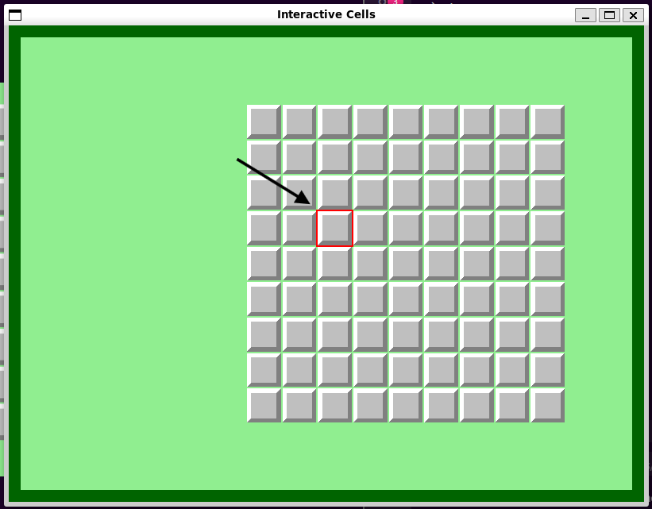
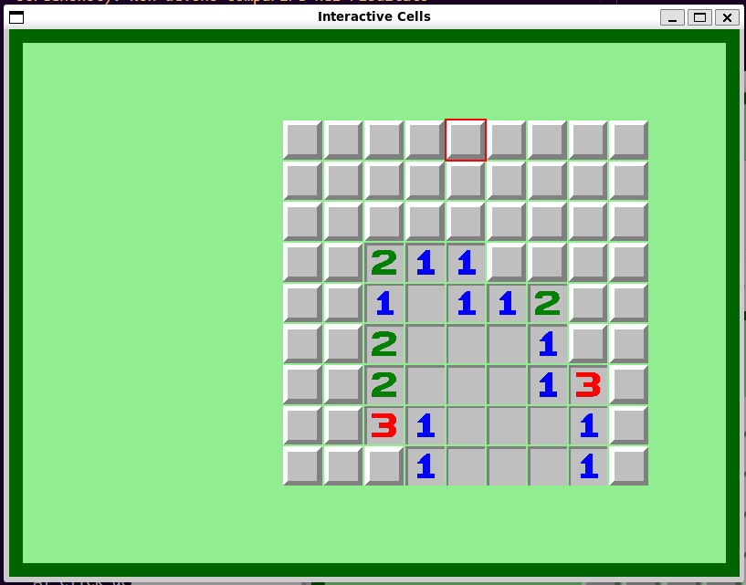
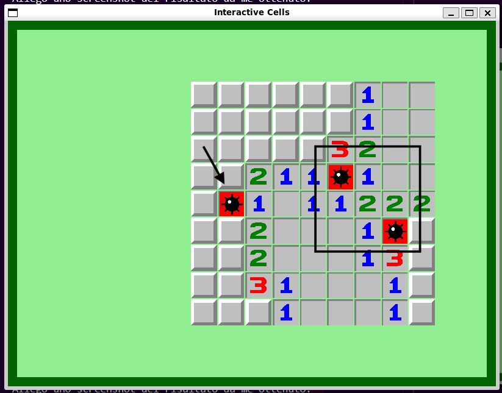

# TAPPA 1B - CELLE INTERATTIVE 

## OBBIETTIVO DELLA TAPPA: 
Rendere le celle interattive:
- creare un meccanismo di focus per le celle al passaggio del mouse
- rendere possibile la rivelazione delle celle singole e la rivelazione a catena (flood reveal)
- fare in modo che la prima mosse porti sempre ad una rivelazione a cascata 
- rendere possibile il posizionamento/rimozione di una bandierina

## COSA È STATO IMPLEMENTATO: 
Rispetto alla tappa precedente:
- è stato creato un nuovo file textures.hpp per la gestione di tutte le texture del gioco.
- sono state implementate diverse funzioni handle per la gestione degli eventi di: click di un pulsante del mouse (click sinistro: rivelazione cella o rivelazione a catena; destro: posizionamento/rimozione bandierina), movimento del mouse (focus), perdita/presa focus della finestra e di eventi non programmati. 
- sono stati definiti diversi nuovi parametri e funzioni a tutte le struct e costanti globali nel codice per gestire correttamente le nuove funzionalità e grafiche di gioco.

 ##### CASO PARTICOLARE PRIMA MOSSA:
Come da regole di gioco è stato fatto in modo che la prima cella rivelata della partita sia sempre vuota e le celle adiacenti non siano mai mine. In questo modo, la prima mossa porterà sempre all'esecuzione di flood_reveal (rivelazione a catena). <br>
Le mine vengono posizionate casualmente solo dopo il primo click, escludendo l'area di partenza.

## ISTRUZIONI PER ESEGUIRE DA TERMINALE: 
Prima di poter scrivere questo comando su terminale, bisogna aver: 
- creato la cartella build 
- configurato tramite cmake 
- compilato con make 

```bash
cd build 
./Tappa1b
```

## VERIFICA DEL RISULTATO:
#### N.B: Le frecce nelle foto sono per indicare un particolare del risultato (tipo la cella con focus del mouse al momento dello screenshot). Non devono comparire nel risultato
#### FOCUS: 
Al passaggio del mouse su una cella, questa dovrebbe avere il bordo illuminato di rosso. <br> <br>
Allego uno screenshot del risultato da me ottenuto:


#### PRIMA MOSSA:
Il primo click sinistro della partita su una cella coperta dovrebbe partire sempre una rivelazione a catena. <br> <br>
Allego uno screenshot del risultato da me ottenuto:


#### RIVELAZIONE CELLA:
Dopo la prima mosse, ogni click sinistro del mouse su una cella sinistra non rivelata dovrebbe portare alla rivelazione di detta cella. Se la cella fosse di tipo numero, detto numero dovrebbe corrispondere al numero di mine adiacenti alla cella. <br> <br>
Allego uno screenshot del risultato da me ottenuto:  


#### CELLA RIVELATA: 
Cliccare su una cella già rivelata non dovrebbe portare ad alcuna azione.

#### BANDIERINA: 
- Al click destro su una cella coperta dovrebbe apparire una bandierina.
- Al click destro su una cella con bandierina, la bandierina dovrebbe sparire. <br> <br>
Allego uno screenshot del risultato da me ottenuto:  


## PROBLEMI RISCONTRATI E SOLUZIONI:
#### PROBLEMA:
Si è voluto aggiungere la caratteristica che la cella su cui passa il mouse venisse illuminata con il bordo rosso per dare focus. Detto bordo però veniva in parte coperto dalle altre celle adiacenti.
#### SOLUZIONE: 
Si è aggiunto un leggero gap tra le celle, ridimensionandole leggermente affinché il bordo fosse ben visibile senza sovrapposizioni.

#### PROBLEMA: 
Nella versione precedente si salvava solo la posizione della cella in pixel, ma non il suo indice riga/colonna. Ciò rendeva difficile il calcolo delle celle adiacenti per la rivelazione a catena. 

#### SOLUZIONE: 
Sono stati aggiunti i parametri row_index e column_index alla struct Cell per averli sempre a portata di mano.

## FONTI DI RIFERIMENTO UTILIZZATE: 
Nessuna (oltre a quelle utilizzate nelle tappe precedenti).

