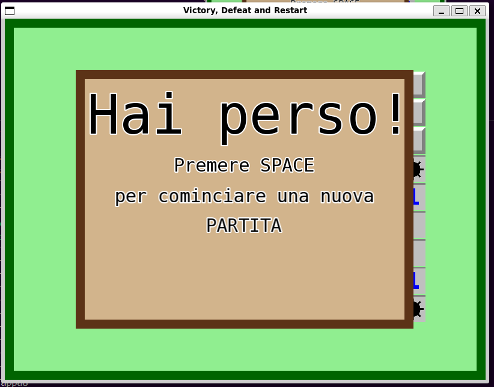

# TAPPA 1C - VITTORIA, SCONFITTA E RESET PER UNA NUOVA PARTITA 

## OBBIETTIVO DELLA TAPPA: 
Rendere la versione base del gioco completa e realmente giocabile, cioè: 
- gestire le condizioni e grafica per la vittoria (condizione: sono state scoperte tutte le celle nella griglia tranne quelle con nascosta una mina) e sconfitta (condizione: è stata scoperta una cella con nascosta una mina);
- permettere il riavvio di una partita; 

## COSA È STATO IMPLEMENTATO: 
Rispetto alla tappa precedente:
- è stata definita la struct (con la sua funzione draw(), parametri e costruttore) per rappresentare il pannello di fine partita (Stop_Panel);
- sono stati definiti/modificati diversi parametri, costruttori e funzioni (all'interno delle varie struct) e costanti globali per gestire correttamente le nuove funzionalità e grafiche di gioco. Ad esempio è stata implmentata la funzione ending_reveal nella struct State per gestire la rivelazione di tutte le celle con cell_type Mine alla fine di una partita; 
- è stato aggiunto lo Stop Panel all'interno della struct  State;
- è stata definita una nuova funzione handle per la gestione dell'evento del premere il pulsante SPACE sulla tastiera (reset di una partita); 
- sono state modificate le funzioni handle di click di un pulsante del mouse e movimento del mouse per fare in modo che non venga eseguita nessuna attività quando il nuovo Stop Panel è visibile;

## VERIFICA DEL RISULTATO:
#### SCONFITTA: 
Alla rivelazione di una mina dovrebbe comparire lo Stop Panel di tipo Lose (quindi con scritto 'Hai Perso!').   
Allego uno screenshot del risultato da me ottenuto:

#### VITTORIA: 
Alla rivelazione di tutte le celle (a parte quelle con nascosta una mina) nella griglia, dovrebbe apparire lo Stop Panel di tipo vittoria (quindi con scritto 'Hai Vinto!').   
Allego uno screenshot del risultato da me ottenuto:

#### RESET: 
Con lo Stop Panel visibile, al click del tasto SPACE la schermata di gioco dovrebbe resettarsi e tornare allo stato di default.
Allego uno screenshot del risultato da me ottenuto:

## PROBLEMI RISCONTRATI E SOLUZIONI: 
Nessuno.

## FONTI DI RIFERIMENTO UTILIZZATE: 
Nessuna (oltre a quelle utilizzate nelle tappe precedenti).

