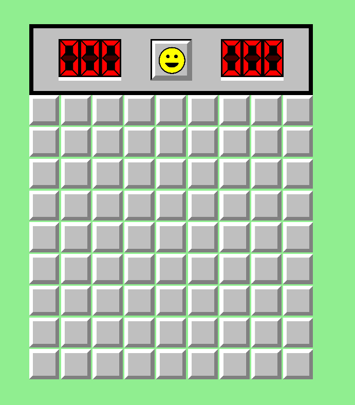

# TAPPA 2A - GRAFICA HEADER 

## OBBIETTIVO DELLA TAPPA: 
Implementazione della grafica di un'intestazione per il pannello di gioco e dei suoi elementi interni, cioè:
- un timer per la partita in corso
- la faccina tipica del gioco stesso Minesweeper 
- un contatore per le bandierine ancora disponibili rispetto al numero totale di mine

## COSA È STATO IMPLEMENTATO: 
Rispetto alla tappa precedente:
- sono state definite le struct (con le loro funzioni draw() e i loro costruttori) per rappresentare un singolo numero (Number); il timer di gioco (Timer) e il contatore di bandierine (Flag_Counter), composti entrambi da tre Number; la faccina (Face); la struttura contenente tutti gli elementi elencati precedentemente (header). 
- è stato aggiunto l'header all'interno della struct Game_Panel
- sono state definite delle nuove costanti globali contenenti le caratteristiche di colore e del bordo dell'header 
- è stata modificato il costruttore Grid per fare in modo che per la posizione y della griglia venga preso in considerazione anche l'header

## ISTRUZIONI PER ESEGUIRE DA TERMINALE: 
Prima di poter scrivere questo comando su terminale, bisogna aver: 
- creato la cartella build 
- configurato tramite cmake 
- compilato con make 

```bash
cd build 
./Tappa2a
```

## VERIFICA DEL RISULTATO: 
All'apertura della finestra, deve comparire esattamente al di sopra della griglia di gioco un rettangolo grigio con bordo nero (l'header) contenente:
- a sinistra tre numeri zero (corrispondenti al timer)
- al centro una faccina sorridente 
- a destra tre numeri zero (corrispondenti al flag counter)
<br><br>
Allego uno screenshot del risultato da me ottenuto:  


## PROBLEMI RISCONTRATI E SOLUZIONI: 
Nessuno.

## FONTI DI RIFERIMENTO UTILIZZATE: 
Nessuna (oltre a quelle utilizzate nelle tappe precedenti).