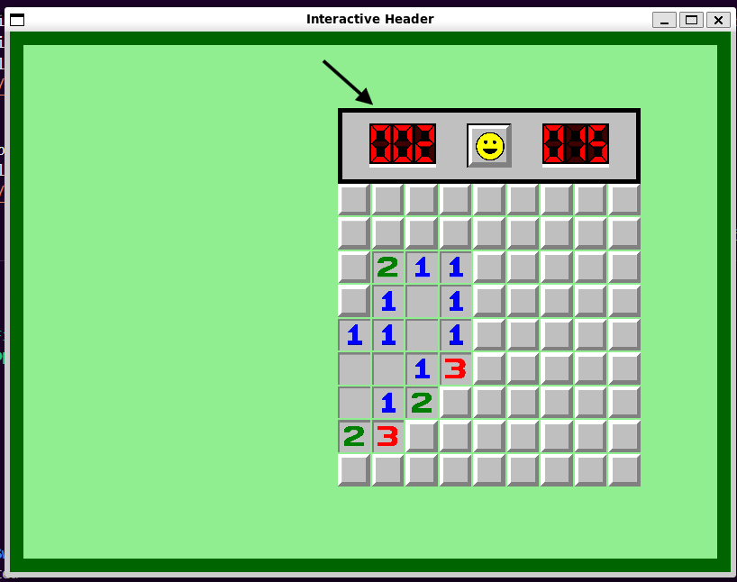
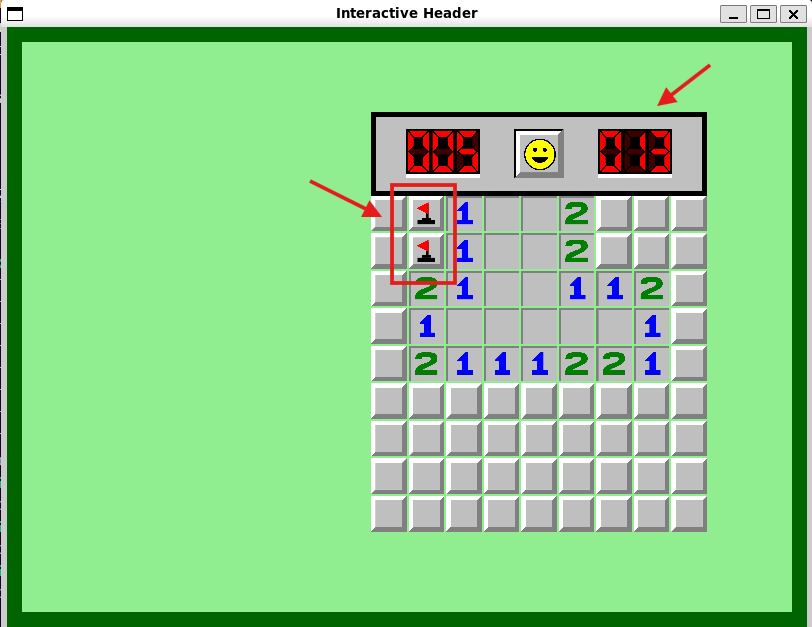
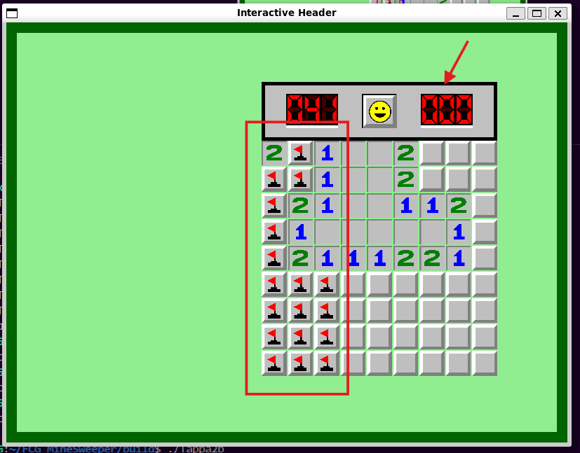
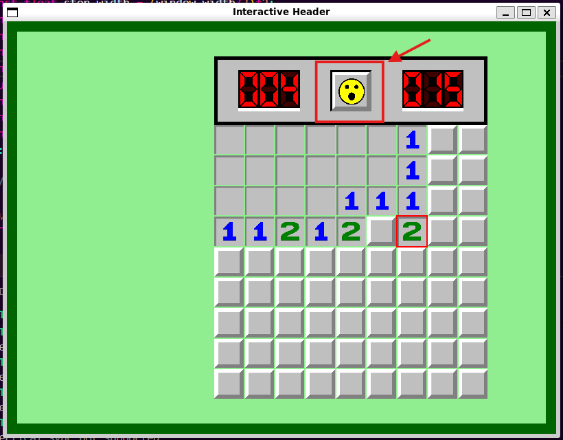

# TAPPA 2B - HEADER INTERATTIVO

## OBBIETTIVO DELLA TAPPA:
Rendere l'header interattivo:
- sviluppare un meccanismo per cui al piazzamento/rimozione di una bandierina nella griglia, il contatore di bandierine cambi di valore di conseguenza;
- sviluppare un meccanismo in modo che la texture della faccina cambi in base agli eventi che avvengono durante la partita (click del tasto sinistro del mouse, vittoria, sconfitta);
- sviluppare un meccanismo in modo che i numeri del Timer cambino in modo da rappresentare sempre i secondi reali di gioco e che il tempo totale di una partita finita venga mostrato nel pannello di fine partita.

## COSA È STATO IMPLEMENTATO: 
Rispetto alla tappa precedente: 
- è stato implementato per il Timer un Clock interno a SFML per il calcolo del tempo reale trascorso; 
- sono stati definiti/modificati diversi parametri, costruttori e funzioni (all'interno di diverse struct nel codice) per gestire correttamente le nuove funzionalità e grafiche di gioco. Ad esempio è stata implementata la funzione set_number all'interno della struct Flag_Counter per l'aggiornamento grafico del contatore di bandierine; 
- è stata aggiunta l'indicazione del tempo totale (formattato in ore, minuti e secondi) nel pannello di fine partita (Stop_Panel);
- è stata definita una nuova funzione handle per gestire il rilascio del pulsante sinistro del mouse in modo da far tornare la faccina allo texture di default (smile_face_texture);
- sono state modificate le funzioni handle per: 
    * la perdita e ripresa del focus in modo da bloccare o far ripartire il timer di gioco;
    * il click di un tasto del mouse per aggiornare correttamente la texture della faccina a quella di click (Click_face_texture).

## VERIFICA DEL RISULTATO: 
#### N.B: Le frecce nelle foto sono per indicare un particolare del risultato (tipo la cella considerata per quella verifica di risultato). Non devono comparire nel risultato
#### INIZIO PARTITA: 
- Appena aperta la finestra (o appena prima dell'inizio di una nuova partita), l'header dovrebbe presentare: 
    * la rappresentazione con tre oggetti Number del numero 000 per il timer;
    * la faccina con la texture di default (smile_face_texture);
    * la rappresentazione con tre oggetti Number del numero 015 per il contatore (cioè il numero di mine nella griglia).
 
- Non dovrebbe essere possibile incrementare/decrementare il contatore bandierine o far partire il timer prima della prima mossa della partita.   
Allego uno screenshot del risultato da me ottenuto:

#### TIMER:
- Dopo la prima mossa, il timer dovrebbe partire in automatico aggiornandosi ogni secondo di gioco.   
Allego uno screenshot del risultato da me ottenuto:

- In caso di perdita del focus della finestra, il timer dovrebbe fermarsi e ripartire solo quando la finestra riprende il focus.

#### FLAG COUNTER:
- Al piazzamento di una bandierina il contatore delle bandierine dovrebbe diminuire di uno, a parte quando arriva a zero (il contatore non ammette numeri negativi).   
Allego uno screenshot del risultato da me ottenuto:

- Al togliere una bandierina, il contatore delle bandierine dovrebbe aumentare di uno. Tuttavia, se anche dopo la rimozione il numero di bandierine presenti supera ancora quello delle mine (ad esempio passando da 17 a 16 bandierine su 15 mine totali), il contatore deve rimanere fisso a zero.   
Allego uno screenshot del risultato da me ottenuto:

#### FACE:  
- Alla rivelazione di una cella coperta tramite click del tasto sinistro del mouse, la faccina dovrebbe cambiare texture in quella sorpresa (Click_face_texture), per poi tornare nella texture di default al rilascio del pulsante (smile_face_texture).
   
Allego uno screenshot del risultato da me ottenuto:

## PROBLEMI RISCONTRATI E SOLUZIONI: 
Nessuno.

## FONTI DI RIFERIMENTO UTILIZZATE: 
Nessuna (oltre a quelle utilizzate nelle tappe precedenti).