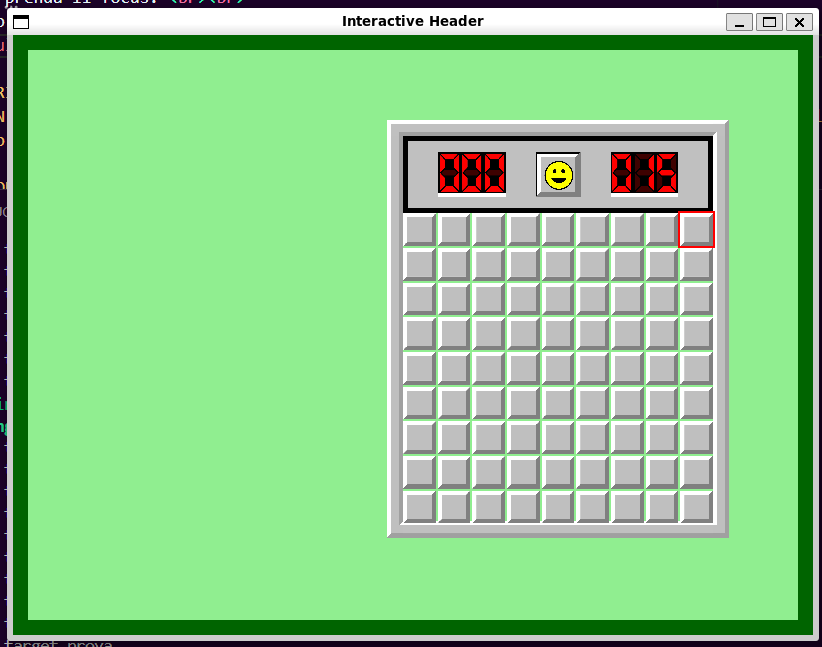

# TAPPA 3 - BORDO

## OBBIETTIVO DELLA TAPPA: 
Completare la grafica del pannello di gioco (Game_Panel) implementando un bordo che vada a racchiudere sia l'header che la griglia di gioco. 

## COSA È STATO IMPLEMENTATO: 
Rispetto alla tappa precedente: 
- sono state definite le struct (con le loro funzioni draw(), campi e i loro costruttori) per rappresentare: 
    * le celle che costituiscono il bordo (Border_Cell); 
    * il bordo stesso (Border); 
- è stato aggiunto l'oggetto Border all'interno della struct Game_Panel; 
- è stata modificato in modo che venga preso in considerazione il nuovo oggetto Border il: 
    * calcolo del campo cell_size nel costruttore della struct Game_Panel;
    * calcolo del campo Grid_pos.y nel costruttore della struct Grid;

## VERIFICA DEL RISULTATO: 
All'apertura della finestra dovrebbe essere visibile un bordo grigio che circonda la griglia di celle e l'header con queste caratteristiche:  
- Il bordo non dovrebbe essere interagibile; 
- Il bordo non dovrebbe andare a coprire l'animazione di focus delle celle;   
Allego uno screenshot del risultato da me ottenuto:

## PROBLEMI RISCONTRATI E SOLUZIONI: 
#### PROBLEMA: 
L'ordine di disegno iniziale (prima grid poi border) nella funzione draw() della struct Game_Panel causava che il bordo grafico (Border) andasse a coprire il gap tra le celle e il bordo e quindi l'effetto di focus (mouse_focus) delle celle esterne.

#### SOLUZIONE: 
È stato invertito l'ordine di disegno in Game_Panel in questo modo: 
- Border 
- Header 
- Grid 
In questo modo, l'animazione di focus delle celle al passaggio del mouse rimane sempre in primo piano.

#### PROBLEMA: 
Inizialmente il bordo doveva essere rappresentato come una griglia di celle adiacenti simile alla struttura Grid.  
Tuttavia questa tipologia di implmentazione risultava molto complessa e comportava la creazione di diversi array di tipo Border_Cell. Tutto ciò andava a complicare di molto il codice, soprattutto se si considera che l'oggetto Borderrimarrà per tutte le prossime tappe solo un oggetto per migliorare la grafica di gioco e non interagibile.

#### SOLUZIONE: 
Si è optato per la creazione di soli 8 oggetti Border_Cell fondamentali:
- 4 Angolari (angle_cells): Quadrati che corrispondono ai vertici del bordo.
- 4 Laterali (side_cells): Rettangoli che si adattano dinamicamente per coprire l'intera lunghezza/altezza tra i quattro angle_cells. 

## FONTI DI RIFERIMENTO UTILIZZATE: 
Nessuna (oltre a quelle utilizzate nelle tappe precedenti).