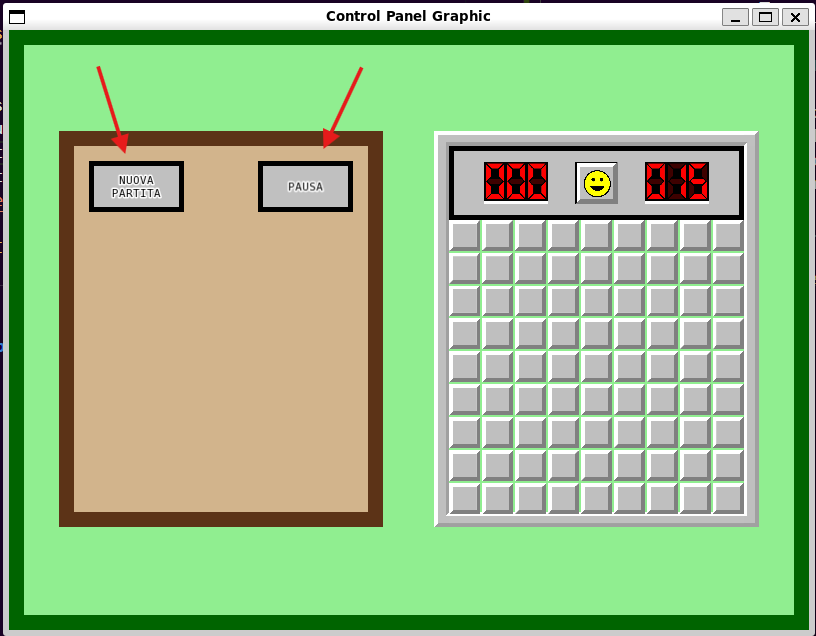

# TAPPA 4A - GRAFICA PANNELLO DI CONTROLLO 

## OBBIETTIVO DELLA TAPPA: 
Implementare la grafica per un pannello di controllo che verrà posizionato alla sinistra della griglia di gioco e che conterrà per ora solo due pulsanti:
- un pulsante per mettere in pausa la partita
- un pulsante per iniziare una nuova partita 

## COSA È STATO IMPLEMENTATO: 
Rispetto alla tappa precedente: 
- sono state definite le struct (con le loro funzioni draw() e i loro costruttori) per rappresentare i bottoni interni ai vari pannelli del gioco (Control_Button); il pannello di controllo (Control_Panel).
- sono state definite delle nuove costanti globali per gli oggetti Control_Button e Control_Panel
- sono state modificate le costanti 'window_horizontal_displacement' e 'window_vertical_displacement' per avere una migliore visibilità del Game Panel e Control Panel 
- è stato modificato in Game_Panel il calcolo della cell_size: ora considera la larghezza della finestra invece dell'altezza.

## ISTRUZIONI PER ESEGUIRE DA TERMINALE: 
Prima di poter scrivere questo comando su terminale, bisogna aver: 
- creato la cartella build 
- configurato tramite cmake 
- compilato con make 

```bash
cd build 
./Tappa4a
```

## VERIFICA DEL RISULTATO: 
#### N.B: Le frecce nelle foto sono per indicare un particolare del risultato (tipo la cella considerata per quella verifica di risultato). Non devono comparire nel risultato
All'apertura della finestra, a sinistra del Game Panel dovrebbe essere visibile il Control Panel con dimensioni uguali a quella del Game Panel e con all'interno i due pulsanti 'Pausa' e 'nuova Partita' in alto. <br><br>
Allego uno screenshot del risultato da me ottenuto:  


## PROBLEMI RISCONTRATI E SOLUZIONI: 
#### PROBLEMA: 
Con l'aggiunta del Control Panel, lo spazio orizzontale si è ridotto. Poiché la cell_size era calcolata sull'altezza della finestra, il Game Panel risultava troppo grande e si sovrapponeva al nuovo pannello o usciva dai bordi.

#### SOLUZIONE: 
Il calcolo della cell_size all'interno del Game_Panel è stato modificato, vincolando la dimensione delle celle alla larghezza disponibile della finestra anziché alla sua altezza.

## FONTI DI RIFERIMENTO UTILIZZATE: 
Nessuna (oltre a quelle utilizzate nelle tappe precedenti).