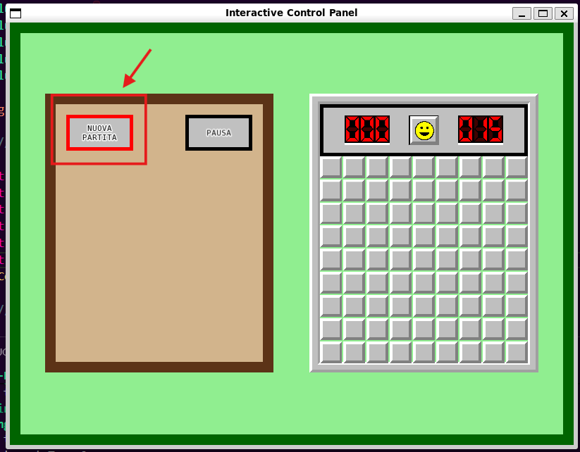
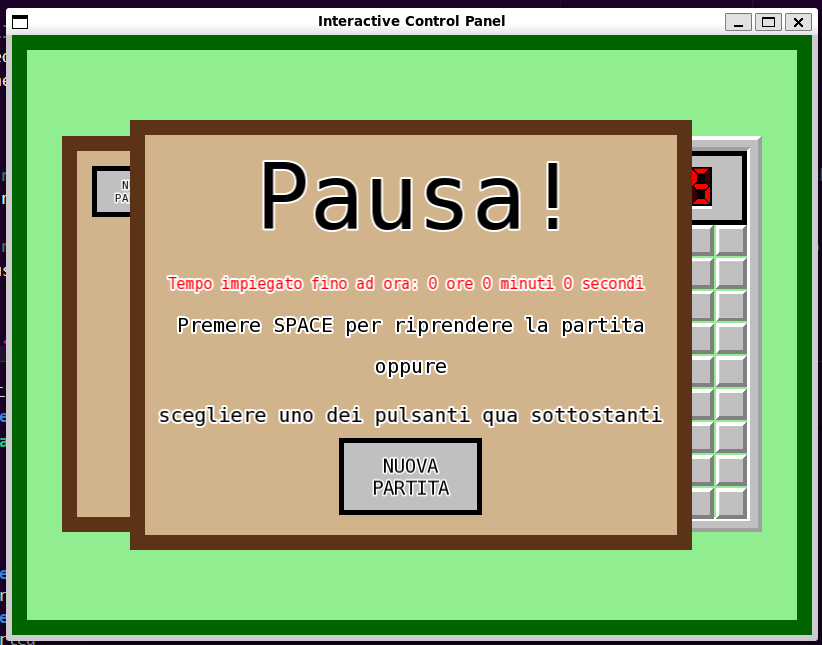
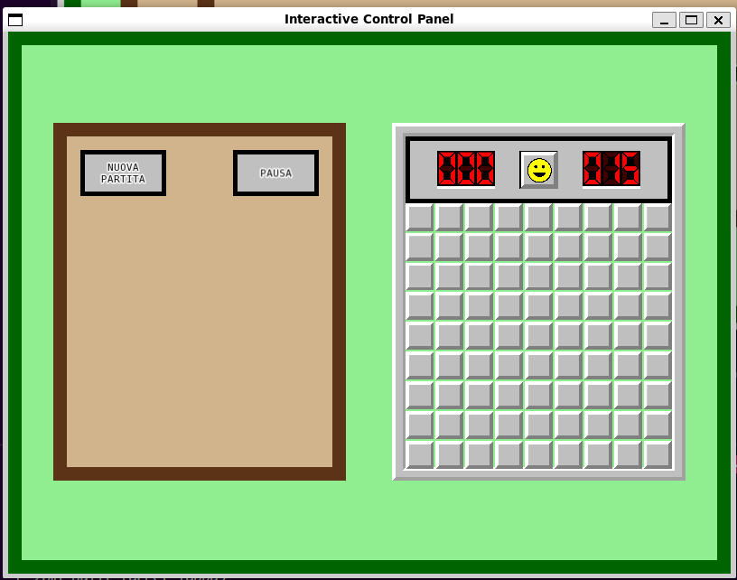
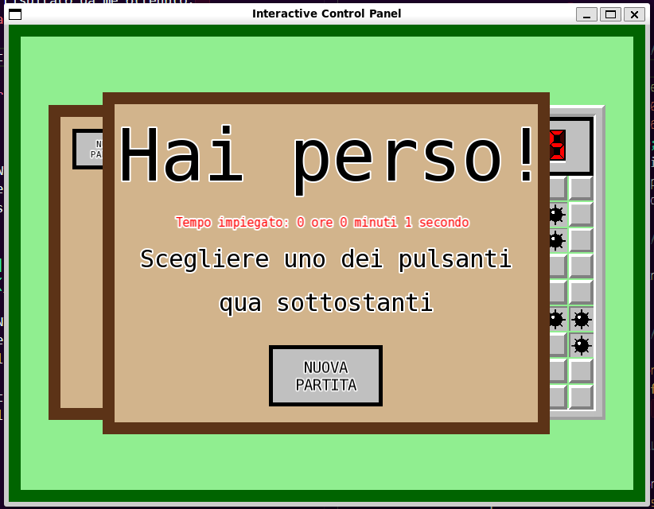
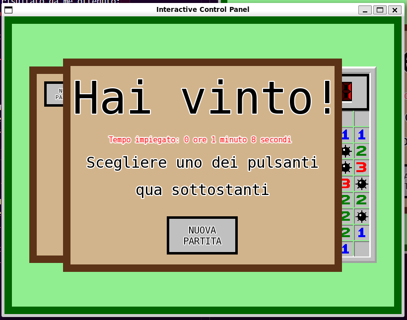

# TAPPA 4B - PANNELLO DI CONTROLLO INTERATTIVO

## OBBIETTIVO DELLA TAPPA: 
- Rendere il Control Panel interattivo: 
    * sviluppare un meccanismo per cui quando viene cliccato il pulsante 'Nuova Partita' (button_type new_game) la schermata di gioco dovrà tornare allo stato di default;
    * sviluppare un meccanismo per cui quando viene cliccato il pulsante quando viene cliccato il pulsante 'Pausa' (button_type pause) la partita in corso dovrà essere messa in pausa;
    * sviluppare un meccanismo per cui i pulsanti abbiano la stessa animazione di focus visivo (bordo rosso) delle celle.
- Gestire la grafica e logica per la pausa del gioco;
- Sviluppare nello Stop Panel un pulsante di 'Nuova Partita' al posto del testo 'premere ENTER per cominciare una nuova partita'.

## COSA È STATO IMPLEMENTATO: 
Rispetto alla tappa precedente: 
- sono stati definiti/modificati diversi parametri, costruttori, funzioni (all'interno di diverse struct nel codice) e costanti globali per gestire correttamente le nuove funzionalità e grafiche di gioco. Ad esempio è stato implmentato un nuovo possibile tipo per la struct Stop_Panel nell'enum class stop_type (Pause), in modo da rendere possibile la rappresentazione del pannello di Pausa;
- è stato aggiunto un nuovo oggetto Control_Button di tipo new_game nello Stop Panel per il reset della partita;
- sono state modificate le funzione per la gestione degli eventi:
    * di perdita di focus per fare in modo che il gico venga automaticamente messo in pausa; 
    * di click/rilascio di un pulsante del mouse e movimento del mouse per gestire i vari Control_Button; 
    * di click del pulsante SPACE su tastiera in modo che permetta di far ripartire la partita se essa è in pausa (Stop_Panel con stop_type Pause visibile).

## VERIFICA DEL RISULTATO: 
#### N.B: Le frecce nelle foto sono per indicare un particolare del risultato (tipo la cella considerata per quella verifica di risultato). Non devono comparire nel risultato
#### FOCUS: 
- Al passaggio del mouse sopra un qualsiasi pulsante, il pulsante dovrebbe avere la stessa animazione di focus che presentano le celle (bordo rosso).   Allego uno screenshot del risultato da me ottenuto:  

#### CONTROL PANEL: 
- Al cliccare con il tasto sinistro del mouse sopra il pulsante PAUSA nel Control Panel dovrebbe comparire lo Stop Panel di tipo Pause e il gioco dovrebbe fermarsi (il valore del timer non dovrebbe più incrementarsi e sia il Control Panel che il Game Panel non dovrebbero essere interagibili).    Allego uno screenshot del risultato da me ottenuto:  

- Al cliccare con il tasto sinistro del mouse sopra il pulsante NUOVA PARTITA nel Control Panel la schermata di gioco dovrebbe tornare alla sua versione di default.    Allego uno screenshot del risultato da me ottenuto:  

#### STOP PANEL: 
- Negli Stop Panel di tipo Win e Lose il testo 'premere ENTER per cominciare una nuova PARTITA' dovrebbe essere stato sostituito da un nuovo pulsante NUOVA PARTITA.    Allego degli screenshots dei risultati da me ottenuti:  
  
 

- Al cliccare il tasto SPACE della tastiera mentre lo Stop Panel di tipo Pause è visibile, la partita che era stata messa in pausa dovrebbe ripartire. Il valore del timer alla ripartenza dovrebbe essere lo stesso di quando la partita è stata messa in pausa. (stesso valore del timer).   

- Al cliccare con il tasto sinistro del mouse il pulsante NUOVA PARTITA in un qualsiasi tipo di Stop Panel, la schermata di gioco dovrebbe tornare alla sua versione di default (quindi con lo Stop Panel non visibile).   Allego uno screenshot del risultato da me ottenuto:  

## PROBLEMI RISCONTRATI E SOLUZIONI: 
Nessuno.

## FONTI DI RIFERIMENTO UTILIZZATE: 
Nessuna (oltre a quelle utilizzate nelle tappe precedenti).