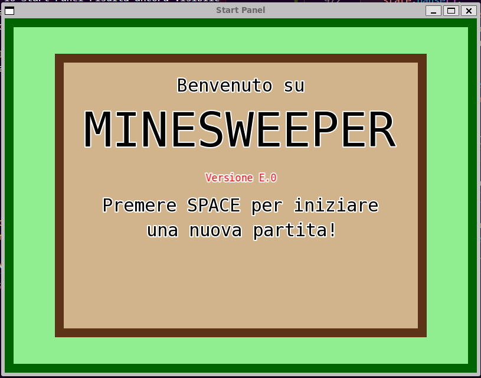
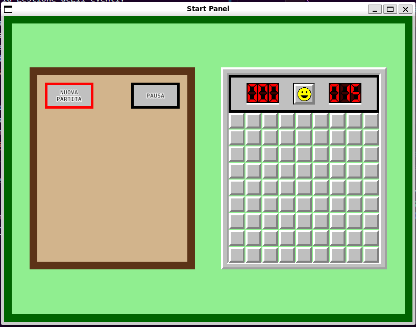

# TAPPA 5 - SCHERMATA INIZIALE

## OBBIETTIVO DELLA TAPPA: 
Creare e rendere interattiva una schermata iniziale per il gioco.

## COSA È STATO IMPLEMENTATO: 
Rispetto alla tappa precedente: 
- è stata definita una nuova struct (con la sua funzione draw(), i suoi campi e costruttore) che rappresenta la schermata iniziale di gioco (Start_Panel); 
- è stato aggiunto l'oggetto Start_Panel all'interno della struct State;
- sono state definite delle nuove costanti globali contenenti le caratteristiche di dimensione, posizione, gap e testo interno del nuovo oggetto Start Panel; 
- è stata modificata la funzione draw() della struct State in modo che, all'apertura della finestra, venga inizialmente reso visibile solo lo Start Panel; 
- sono state modificate le funzione per la gestione degli eventi:
    * perdita di focus in modo che lo Stop_Panel con stop_type Pause non diventi visibile nel caso lo Start_Panel sia ancora visibile;
    * di click del tasto SPACE sulla tastiera in modo che tolga la visibilità allo Start_Panel e renda visibile la schermata di gioco; 
    * di click di un tasto e movimento del mouse in modo che non provochino nessuna azione se lo Start_Panel è visibile; 

## VERIFICA DEL RISULTATO: 
- All'apertura della finestra non dovrebbe più apparire di default la schermata di gioco ma la schermata iniziale (Start_Panel).   
Allego uno screenshot del risultato da me ottenuto:  

- Al cliccare il tasto SPACE su tastiera, quando la schermata iniziale è ancora visibile, la schermata iniziale dovrebbe essere sostituita da quella di gioco di default.
  
Allego uno screenshot del risultato da me ottenuto:  

## PROBLEMI RISCONTRATI E SOLUZIONI: 
Nessuno.

## FONTI DI RIFERIMENTO UTILIZZATE: 
Nessuna (oltre a quelle utilizzate nelle tappe precedenti).