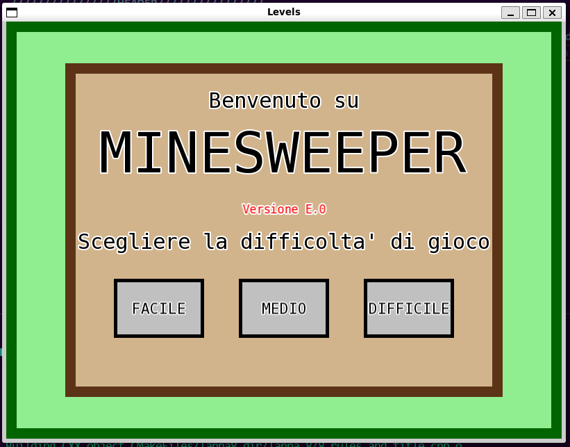
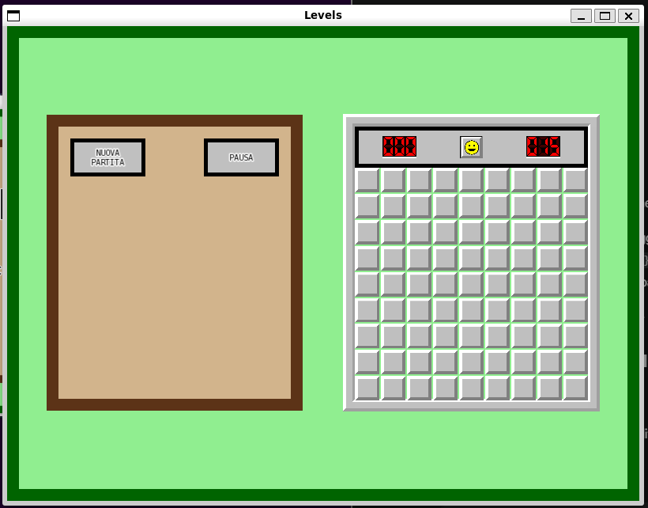
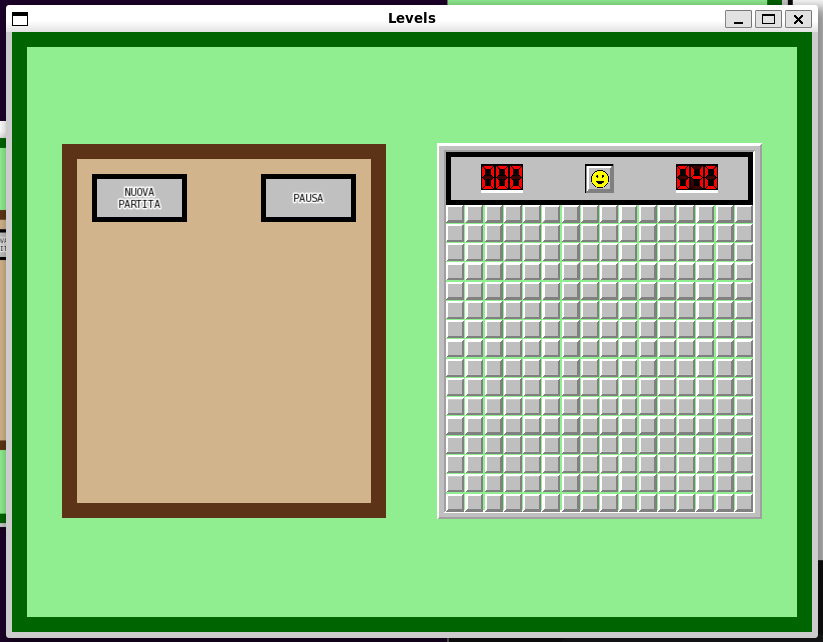
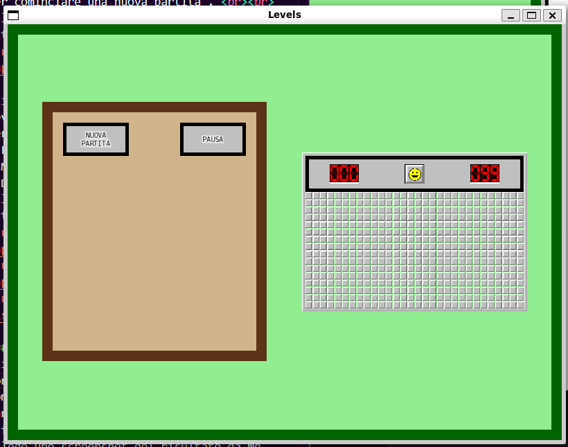
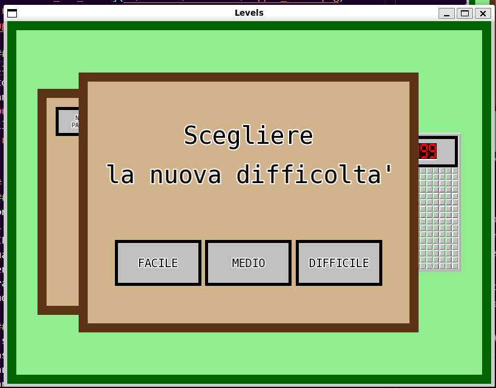

# TAPPA 6 - LIVELLI DI DIFFICOLTÀ

## OBBIETTIVO DELLA TAPPA: 
Implementare i restanti due livelli di difficoltà del gioco in modo che vi siano tre livelli di difficoltà totali di gioco:  
- FACILE: 
    * dimensione griglia: 9x9 celle
    * numero mine: 15 
- MEDIO: 
    * dimensione griglia: 16x16 celle
    * numero mine: 40
- DIFFICILE: 
    * dimensione griglia: 30x20 celle
    * numero mine: 99 
Implementare, inoltre, un meccanismo che permetta di selezionare la difficoltà desiderata direttamente dalla schermata iniziale.

## COSA È STATO IMPLEMENTATO: 
Rispetto alla tappa precedente: 
- sono stati definiti/modificati diversi parametri, costruttori, funzioni (all'interno di diverse struct nel codice) e costanti globali per gestire correttamente le nuove funzionalità e grafiche di gioco. Ad esempio, è stato modificato il campo h_size.y della struct Header (che corrisponde all'altezza dell'header) in modo che sia sempre un valore fisso un'altezza fissa (indipendentemente dalla modalità di gioco scelta e quindi dalla grandezza delle celle nella griglia) per garantirne sempre una buona leggibilità;
- sono state modificate le funzioni per la gestione degli eventi di: 
    * click di un tasto e movimento del mouse in modo che gestisca anche i nuovi tre pulsanti creati per la scelta della difficoltà di gioco (FACILE, MEDIO e DIFFICILE); 
    * click di un tasto sulla tastiera in modo che non provochi più il cambio di schermata dalla iniziale (Start_Panel) a quella di gioco ma gestisca solo il rinizio di una partita in caso di pausa; 
 
## VERIFICA DEL RISULTATO: 
#### N.B: Le frecce nelle foto sono per indicare un particolare del risultato (tipo la cella considerata per quella verifica di risultato). Non devono comparire nel risultato
#### START PANEL
- All'apertura della finestra, nello Start Panel, al posto del testo 'Premere ENTER per cominciare una nuova partita', dovrebbero apparire tre nuovi pulsanti per la scelta della difficoltà della partita che si andrà a giocare.   
Allego uno screenshot del risultato da me ottenuto:  

- Cliccando su uno dei pulsanti per la scelta della difficoltà, la schermata iniziale (Start_Panel) dovrebbe essere sostituita con quella di gioco nella modalità scelta, quindi:
    * FACILE: griglia 9x9 e 15 mine. 
    * MEDIO: griglia 16x16 e 40 mine. 
    * DIFFICILE: griglia 30x20 e 99 mine.   
Allego degli screenshot dei risultati da me ottenuti: 
FACILE:

MEDIO:

DIFFICILE:

#### PANNELLI:
- Cliccando il pulsante NUOVA PARTITA (dal Control Panel o dagli Stop Panel), dovrebbe comparire il menu di scelta difficoltà (Stop Panel tipo New_Game) che permette di scegliere la difficoltà di gioco per la nuova partita.  
Allego uno screenshot del risultato da me ottenuto:  

## PROBLEMI RISCONTRATI E SOLUZIONI: 
#### PROBLEMA 
Con l'introduzione delle difficoltà MEDIO e DIFFICILE, il numero di celle aumenta drasticamente e, per quanto riguarda la modalità DIFFICILE, va a modificare anche l'aspetto della griglia da quadrata a rettangolare. 
Per queste due nuove modalità la griglia e il panel (essendo che era stato impostato che avessere sempre le stesse dimensioni) andavano a coprirsi l'uno con l'altro.

#### SOLUZIONE 
È stata implementata una nuova funzione set_difficulty nella struct State in modo che, in base alla difficoltà di gioco scelta, venga variata la dimensione del Game Panel in modo che sia sempre contenuto nello spazio tra il Control Panel e il bordo della finestra.  
Essendo, onoltre, che la funzione reset della struct State non va a ridefinire il Control_Panel, esso rimarrà sempre delle stesse dimensioni e nella stessa posiziona qualsiasi sia la difficoltà di gioco in modo che sia sempre perfettamente leggibile. 

#### PROBLEMA: 
Con il cambiamento delle dimensioni del Game Panel si andava anche a variare, oltre alla dimensione griglia, anche la dimensione dell'Header e dei suoi elementi rendendoli in alcuni casi illeggibili. 

#### SOLUZIONE: 
Si è optato per lasciare sempre uguali (cioè con gli stessi valori che avrebbero nella modalità EASY di gioco) l'altezza dell'Header e le dimensioni dei suoi elementI, svincolandoli dalla grandezza della griglia tramite l'utilizzo delle costanti starting_cell_size e header_grid_proportion.

## FONTI DI RIFERIMENTO UTILIZZATE: 
Nessuna (oltre a quelle utilizzate nelle tappe precedenti).