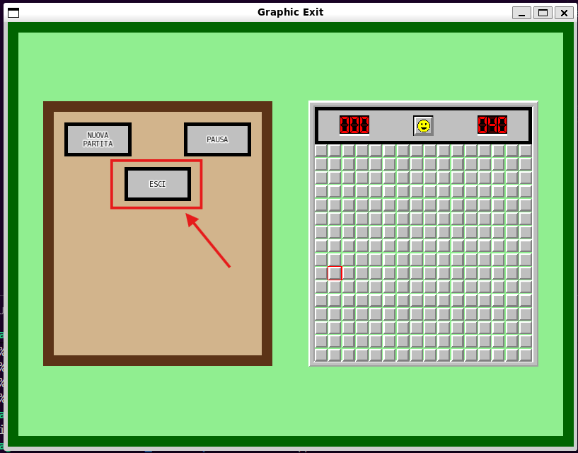
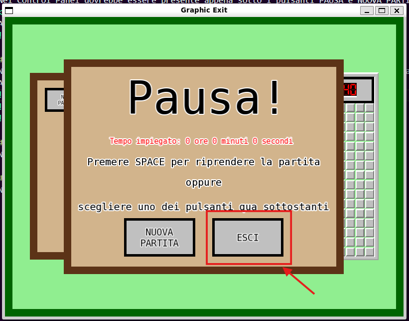
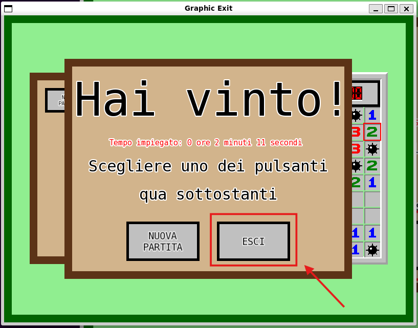
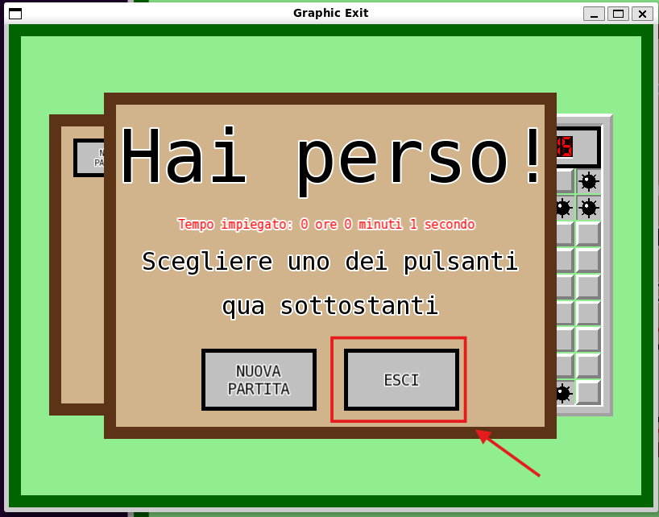

# TAPPA 7A - GRAFICA PULSANTE DI EXIT 

## OBBIETTIVO DELLA TAPPA: 
Creare la grafica per un nuovo pulsante ESCI che dovrà trovarsi:  
- nel pannello di controllo;
- nel pannello di pausa;
- nel pannello di vittoria/sconfitta.

## COSA È STATO IMPLEMENTATO: 
Rispetto alla tappa precedente: 
-  sono stati definiti/modificati diversi parametri, costruttori, funzioni draw (tutto ciò all'interno delle struct Control_Panel e Stop_Panel) e costanti globali per la corretta implementazione del nuovo pulsante. Correttamente le nuove funzionalità e grafiche di gioco. Ad esempio, è stata modificato il calcolo della posizione del pulsante NUOVA PARTITA (button_type new_game) nella struct Stop_Panel in modo da fare spazio al nuovo pulsante appena creato.

## VERIFICA DEL RISULTATO: 
#### N.B: Le frecce nelle foto sono per indicare un particolare del risultato (tipo la cella considerata per quella verifica di risultato). Non devono comparire nel risultato.
#### CONTROL PANEL: 
All'interno del Control Panel dovrebbe essere presente (al di sotto dei pulsanti PAUSA e NUOVA PARTITA e centrale in orizzontale) il nuovo pulsante ESCI.   
Allego uno screenshot del risultato da me ottenuto:  

#### STOP PANEL: 
Negli Stop Panel di tipo Pause, Win e Lose ora dovrebbe essere presente anche il pulsante ESCI al fianco del pulsante NUOVA PARTITA.   
Allego degli screenshot dei risultati da me ottenuti:  

## PROBLEMI RISCONTRATI E SOLUZIONI: 
Nessuno.

## FONTI DI RIFERIMENTO UTILIZZATE: 
Nessuna (oltre a quelle utilizzate nelle tappe precedenti).
