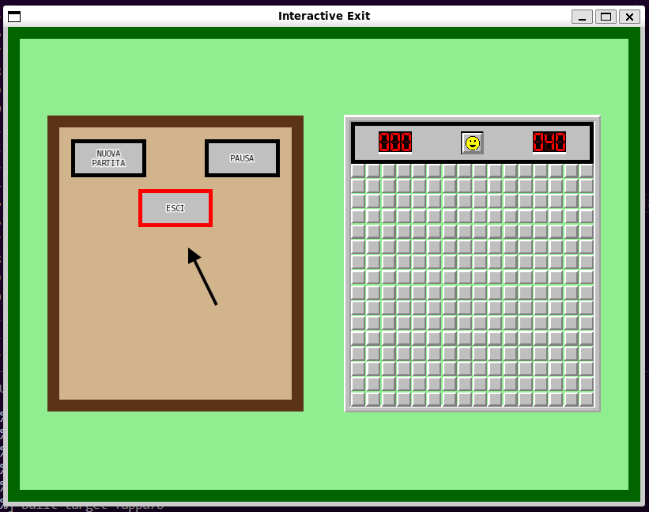
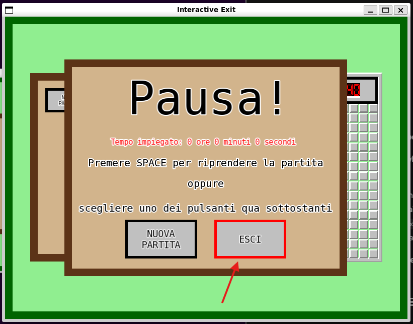
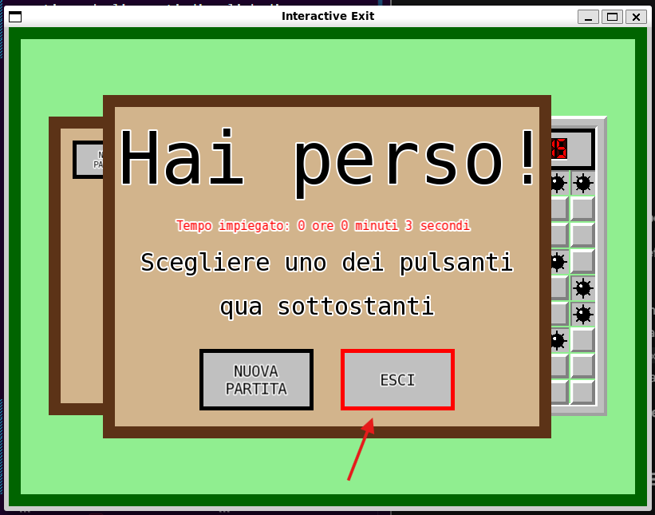
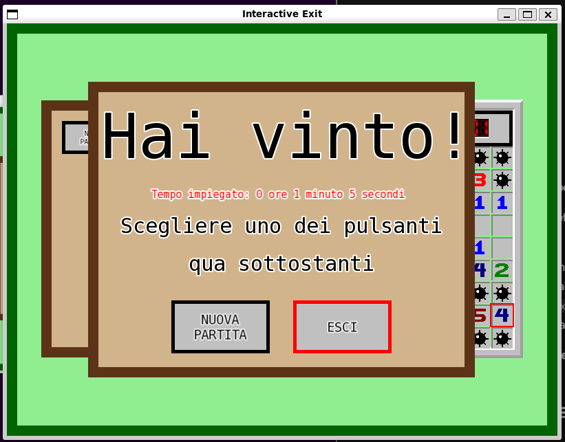
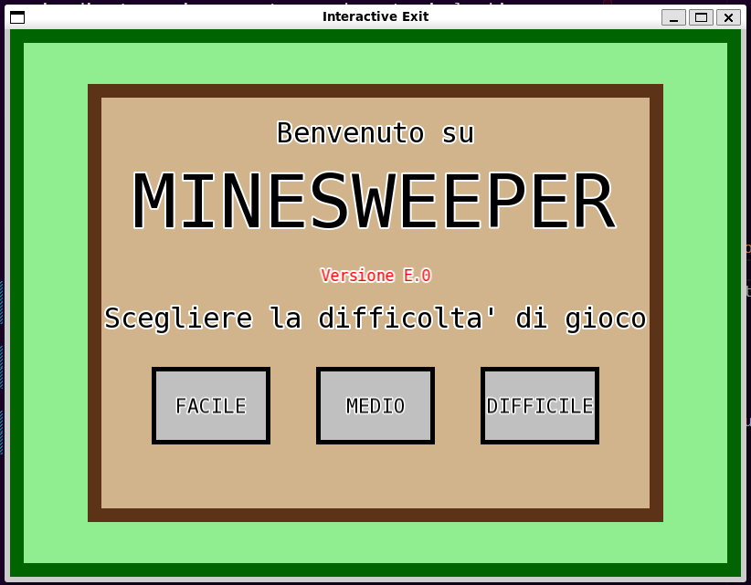

# TAPPA 7B - PULSANTE DI USCITA INTERATTIVO

## OBBIETTIVO DELLA TAPPA: 
Rendere interattivo il pulsante ESCI nei vari pannelli in modo che permetta quando cliccato di lasciare la schermata di gioco e tornare a quella iniziale.

## COSA È STATO IMPLEMENTATO: 
Rispetto alla tappa precedente: 
- è stata implementata la funzione exit() nella struct State. Tale funzione rende nuovamente visibile lo Start_Panel e invoca il metodo reset(), permettendo il reset della schermata di gioco e il ritorno alla schermata iniziale;
- sono state modificate le funzioni per la gestione degli eventi di: 
    * click di un tasto e movimento del mouse in modo che gestiscano anche il nuovo pulsante creato;

## VERIFICA DEL RISULTATO: 
#### N.B: Le frecce nelle foto sono per indicare un particolare del risultato (tipo la cella considerata per quella verifica di risultato). Non devono comparire nel risultato
- Al passaggio del mouse sopra al pulsante ESCI (sia nel Control Panel che negli Stop Panel di tipo Pause, Win e Lose), si dovrebbe avere la stessa animazione di focus degli altri pulsanti di gioco.   
Allego gli screenshot dei risultati da me ottenuti:  

- Cliccando il pulsante ESCI sia nel Control Panel che negli Stop Panel di tipo Pause, Win e Lose la schermata di gioco dovrebbe chiudersi e dovrebbe ricomparire la schermata iniziale (Start Panel).   
Allego uno screenshot del risultato da me ottenuto:  

## PROBLEMI RISCONTRATI E SOLUZIONI: 
Nessuno.

## FONTI DI RIFERIMENTO UTILIZZATE: 
Nessuna (oltre a quelle utilizzate nelle tappe precedenti).