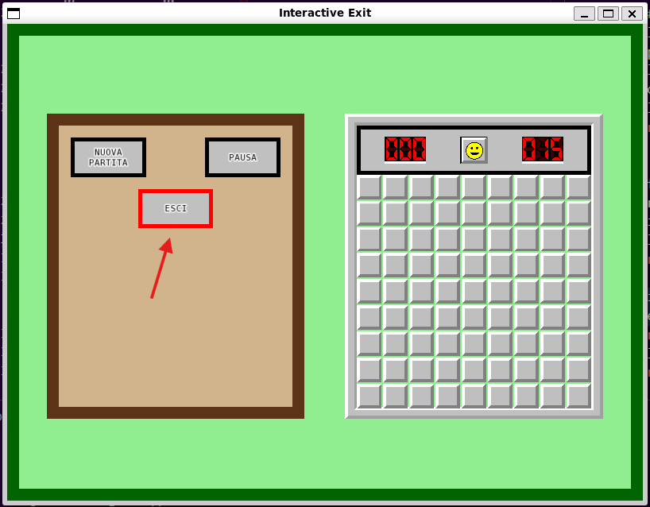
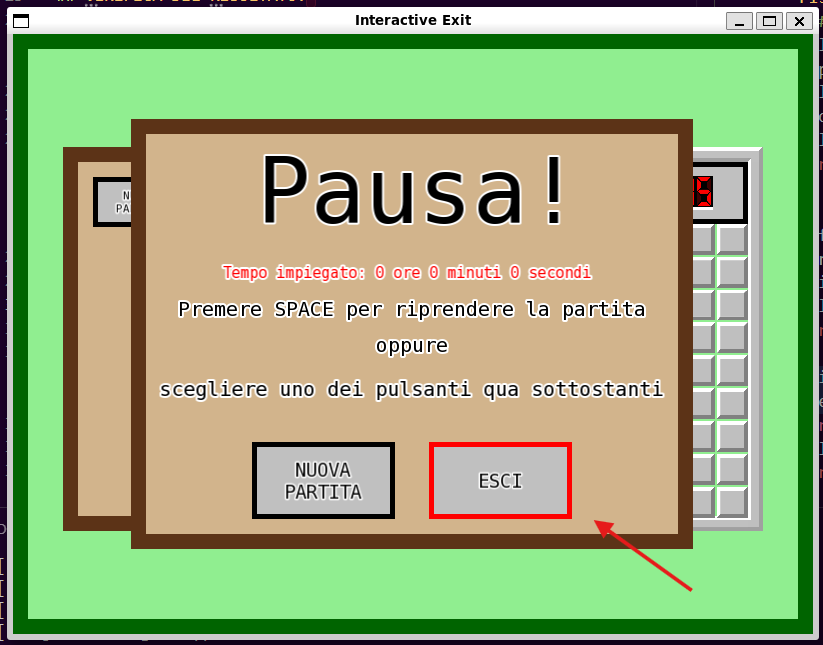

# TAPPA 7B - PULSANTE DI USCITA INTERATTIVO

## OBBIETTIVO DELLA TAPPA: 
Rendere interattivo il pulsante ESCI nei vari pannelli in modo che riporti alla schermata iniziale.

## COSA È STATO IMPLEMENTATO: 
Rispetto alla tappa precedente: 
- è stata implmentata una nuova funzione nella struct State per la gestione dell'uscita dalla schermata di gioco e il ritorno alla schermata iniziale. 
- sono state modificate le funzioni per la gestione degli eventi del click di un pulsante e movimento del mouse in modo che gestiscano anche il click e focus per il nuovo pulsante creato.

## ISTRUZIONI PER ESEGUIRE DA TERMINALE: 
Prima di poter scrivere questo comando su terminale, bisogna aver: 
- creato la cartella build 
- configurato tramite cmake 
- compilato con make 

```bash
cd build 
./Tappa7b
```

## VERIFICA DEL RISULTATO: 
#### N.B: Le frecce nelle foto sono per indicare un particolare del risultato (tipo la cella considerata per quella verifica di risultato). Non devono comparire nel risultato
- Al passaggio del mouse sopra al nuovo pulsante ESCI sia nel Control Panel che negli Stop Panel di tipo Pause, Win e Lose, il bordo di detto pulsante dovrebbe diventare da nero a rosso e poi tornare nero appena il mouse si sposta al di fuori dei confini del pulsante. <br><br>
Allego gli screenshot dei risultati da me ottenuti:  



- Cliccando il pulsante ESCI sia nel Control Panel che negli Stop Panel di tipo Pause, Win e Lose la schermata dovrebbe cambiare in quella iniziale. 

## PROBLEMI RISCONTRATI E SOLUZIONI: 
Nessuno.

## FONTI DI RIFERIMENTO UTILIZZATE: 
Nessuna (oltre a quelle utilizzate nelle tappe precedenti).