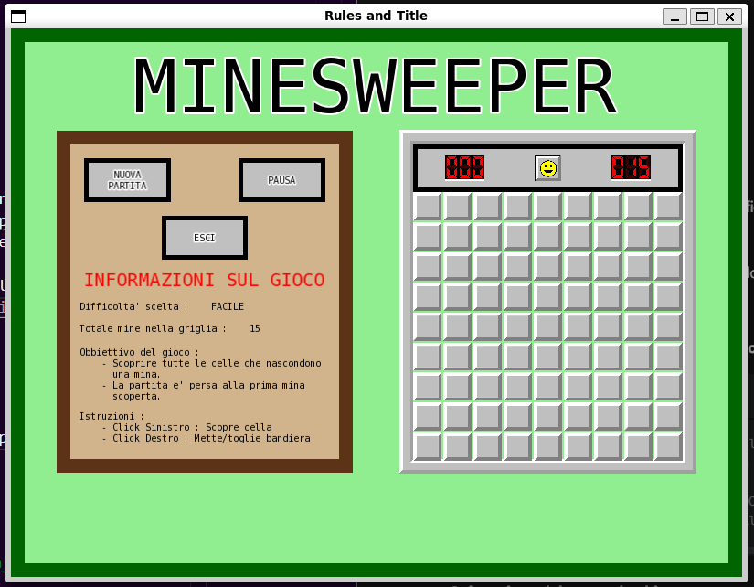

# TAPPA 8 - INFORMAZIONI, REGOLE, OBBIETTIVO E TITOLO DI GIOCO 

## OBBIETTIVO DELLA TAPPA: 
Completare il gioco aggiungendo: 
- il titolo del gioco (MINESWEEPER) in alto nella schermata di gioco;
- le istruzioni, l'obiettivo, le regole di gioco e le caratteristiche della partita corrente (difficoltà e mine) all'interno del pannello di controllo;

## COSA È STATO IMPLEMENTATO: 
Rispetto alla tappa precedente: 
- è stato ridotto il valore della costante window_vertical_displacement in modo da creare lo spazio necessario al titolo all'interno della schermata di gioco (Game_Panel e Control_Panel);
- sono state definite nuove costanti globali nel codice e definiti/modificati diversi parametri, costruttori, funzioni  delle struct State e Control_Panel per la gestione del nuovo testo. Ad esempio, è stato aggiunto un oggetto sf::Text in entrambe le struct;

## VERIFICA DEL RISULTATO: 
Nella schermata di gioco, dovrebbe comparire, oltre a ciò che appariva già nelle tappe precedenti, anche; 
- il testo "MINESWEEPER" centrato in orizzontale e in verticale sopra il Control Panel e il Game Panel. 
- un testo interno al Control Panel che va ad indicare: 
    * la difficoltà di gioco scelta per la partita in corso 
    * il numero di mine nella griglia della partita in corso;
    * obbiettivo e regole del gioco;   
Allego uno screenshot del risultato da me ottenuto:  

## PROBLEMI RISCONTRATI E SOLUZIONI: 
Nessuno.

## FONTI DI RIFERIMENTO UTILIZZATE: 
Nessuna (oltre a quelle utilizzate nelle tappe precedenti).